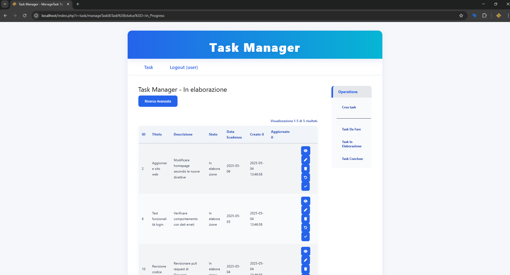

# Task Manager

Task Manager è un'applicazione web semplice costruita con il framework PHP Yii che consente agli utenti di gestire in modo efficiente le proprie attività personali. Ogni utente ha il proprio set di attività, e l'applicazione fornisce un'interfaccia intuitiva per creare, aggiornare, visualizzare ed eliminare le attività.

## Descrizione

Questo progetto è stato sviluppato come soluzione pratica per l'organizzazione delle attività quotidiane. Offre un sistema completo di gestione delle attività con categorizzazione per stato (Da fare, In elaborazione, Conclusa), permettendo agli utenti di tenere traccia dei propri impegni in modo semplice ed efficace. L'interfaccia user-friendly rende l'applicazione accessibile a tutti, mentre la struttura basata su Yii Framework garantisce prestazioni affidabili e una base solida per eventuali espansioni future.

**Nota importante:** Questa applicazione è progettata esclusivamente per uso locale e didattico. Le password sono memorizzate in chiaro nel database per facilitare lo sviluppo e l'apprendimento, rendendo l'applicazione inadatta per ambienti di produzione.

## Funzionalità

- **Registrazione e Accesso Utenti:**  
  Gli utenti possono registrarsi e accedere per gestire le proprie attività.  
  > **Nota:** Le password **non sono hashate** in questa applicazione. Questa è una scelta deliberata, poiché l'applicazione è progettata per uso locale e permette il recupero delle password direttamente dal database.

- **Gestione delle Attività:**  
  - Creazione di nuove attività con titolo, descrizione, stato e data di scadenza.
  - Aggiornamento delle attività esistenti.
  - Eliminazione delle attività con conferma.
  - Visualizzazione dei dettagli delle attività.
  - Filtro e ricerca delle attività per stato e altri campi.
  - Le attività sono categorizzate per stato:  
    - **Da fare** (To_Do)  
    - **In elaborazione** (In_Progress)  
    - **Conclusa** (Done)

- **Isolamento Utente:**  
  Ogni utente vede e gestisce solo le proprie attività.

- **Ricerca Avanzata:**  
  Utilizza il modulo di ricerca avanzata per filtrare le attività in base a vari criteri, inclusi intervalli di date.

- **Localizzazione:**  
  L'applicazione è localizzata in italiano.

## Installazione

1. **Clona il repository:**
   ```bash
   git clone https://github.com/TopalliAlesjo/TaskManager-PHP-Yii.git
   ```

2. **Configura il database:**
   - Modifica `protected/config/database.php` per adattarlo alle impostazioni del tuo MySQL.
   - Importa lo schema dal file `TaskManager/TaskManager/protected/data/taskmanager.sql` nel tuo database MySQL. Questo file contiene tutte le tabelle necessarie per il funzionamento dell'applicazione.

## Avviso di Sicurezza

**IMPORTANTE:** Le password in questa applicazione sono **memorizzate in chiaro** nel database. Questa è una **scelta deliberata** per:

- Facilitare lo sviluppo locale
- Consentire scopi didattici
- Permettere il recupero diretto delle password dal database

Questa implementazione rende l'applicazione inadatta per ambienti di produzione. **NON utilizzare questa applicazione con dati sensibili o in contesti che richiedono standard di sicurezza elevati.**

## Screenshot

L'applicazione include le seguenti visualizzazioni principali:

1. **Attività Da Fare** - Visualizzazione delle attività in stato "Da fare"
   

2. **Attività In Elaborazione** - Visualizzazione delle attività in stato "In elaborazione"
   

3. **Attività Concluse** - Visualizzazione delle attività in stato "Concluse"
   

4. **Creazione Attività** - Interfaccia per la creazione di nuove attività
   

5. **Visualizzazione Dettagli** - Interfaccia per visualizzare i dettagli di un'attività
   

## Licenza
Questo progetto è distribuito sotto licenza Creative Commons Attribution-NonCommercial-NoDerivatives 4.0 International (CC BY-NC-ND 4.0).

- **Non è consentita la vendita o l'uso commerciale del software.**
- **Non è consentita la modifica, trasformazione o creazione di opere derivate.**
- È permessa solo la consultazione e l'utilizzo per scopi personali e non commerciali.

Per il testo completo della licenza visita: https://creativecommons.org/licenses/by-nc-nd/4.0/deed.it

Sviluppato da Alesjo Topalli  
Per domande: dev@alesjotopalli.com
